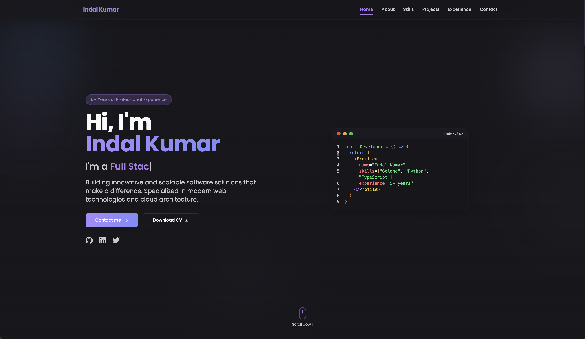

# Portfolio

This is my portfolio website, showcasing my projects, skills, and experience. It is built using TypeScript, Next.js, Tailwind CSS, and utilizes CI/CD pipelines for continuous integration and deployment.

# Screenshots



## Technologies Used

- TypeScript: A statically typed superset of JavaScript that adds optional static typing.
- Next.js: A React framework for building server-side rendered and statically generated web applications.
- Tailwind CSS: A utility-first CSS framework for quickly building custom designs without writing CSS from scratch.
- CI/CD: Continuous Integration and Continuous Deployment pipelines automate the build, test, and deployment process.
- Docker: A containerization platform used to package and distribute the application and its dependencies.
- Shadowing: Technique used to add depth and visual appeal to the user interface.

## Features

- Responsive Design: The website is optimized for various screen sizes and devices.
- CI/CD Pipeline: Automated pipelines ensure smooth integration and deployment of changes.
- Containerization: Docker containers provide consistency and portability across different environments.
- Visual Enhancements: Shadowing effects add depth and enhance the visual appeal of the website.

## Getting Started

To run the project locally, follow these steps:

1. Clone the repository:

   ```bash
   git clone https://github.com/your-username/portfolio-website.git
   ```
